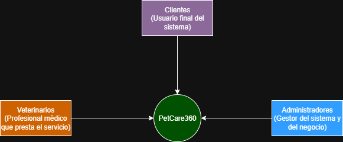
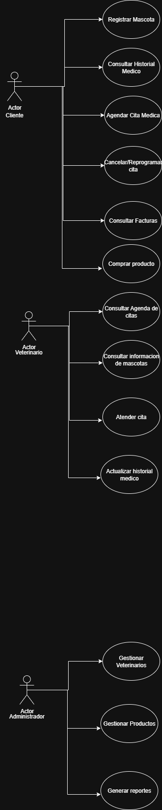
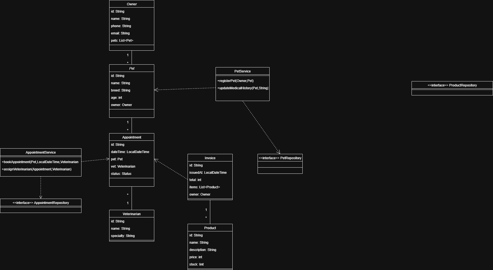

# PetCare360
Repositorio para el alojamiento de proyecto PetCare360 

Este proyecto va a consistir en un sistema de gestion para una tienda de mascotas / veterinaria en **SpringBoot**.

**En este sistema se podra:**
- Registrar mascotas con sus características (raza, edad, historial médico).
- Agendar citas médicas y asignar veterinarios.
- vender productos de cuidado animal y asignar veterinarios.
- generar facturacion para cada servicio o compra.
---
**Ejecucion:**
Para ejecutar el proyecto vamos a ejecutarlo desde la clase principal "PetCare360Application.java" y desde ahi se desplegara la aplicacion.

Desde la terminal:
- Para compilar el proyecto: **mvn clean install**
- Para ejecutarlo: **mvn spring-boot:run**

Una vez corriendo el proyecto, la documentacion de la API se encontrara en: **http://localhost:8080/swagger-ui.html**

---
**Tecnologias utilizadas:**
- **Java 17**
- **Spring Boot 3.5.6**
- **Maven** (gestion de dependencias y build)
- **JUnit 5** (testing)
- **Lombok** (eliminación de boilerplate)
- **Swagger UI (SpringDoc OpenAPI)** (documentación de API)
- **Jacoco** (cobertura de pruebas)
- **SonarQube** (análisis de calidad de código)
---
# Diagramas

### Diagrama de contexto

Se muetran los principales actores interactuando con el sistema
### Diagrama de casos de uso

Casos de uso en nuestro sistema
### Diagrama de clases

Diagrama de clases base, sujeto a modificaciones

## Patrones de diseño
-Repository:
Separara el acceso a datos de la lógica de negocio.
Justificación: fácil probar y cambiar motor de BD.

-Strategy:
Permitira definir distintas estrategias de cálculo ( facturación, descuentos, impuestos).
Justificación: evita if/else extensos y facilita agregar nuevas reglas.

-Factory:
Para crear objetos complejos como facturas (InvoiceFactory).
Justificación: centraliza la creación y evita código duplicado.

## Principios SOLID
- S: AppointmentController solo manejara requests, AppointmentService la lógica.

- O: BillingStrategy permitira nuevas formas de cálculo sin modificar el código existente.

- L: Veterinarian y SpecialistVeterinarian seran intercambiables en métodos de citas.

- I: Interfaces pequeñas: PetReadService, PetWriteService.

- D: Servicios dependeran de interfaces (AppointmentRepository, BillingStrategy), no de clases

## Estrategia de ramas 

Estructura de ramas: 
"feature/nombre de funcionalidad"