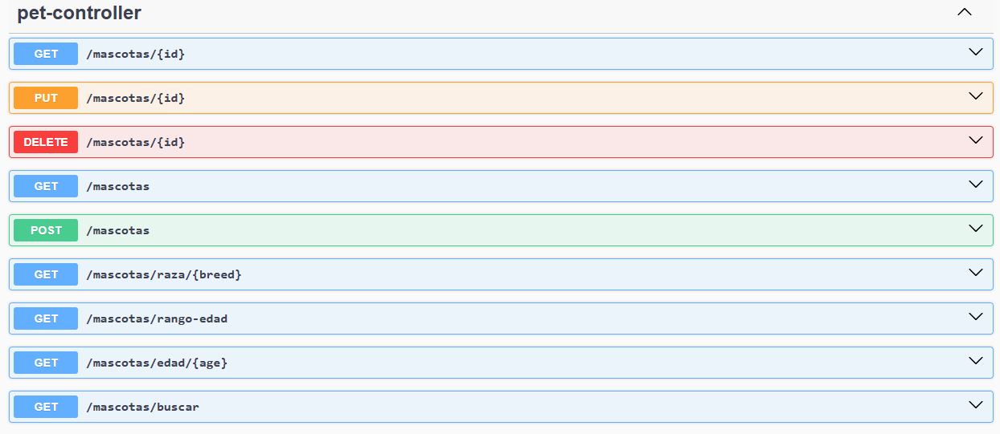
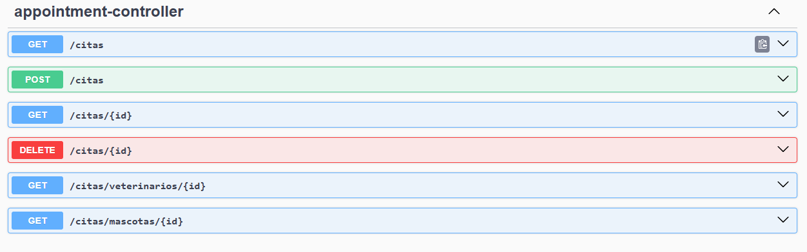

# PetCare360
Repositorio para el alojamiento de proyecto PetCare360 

Este proyecto va a consistir en un sistema de gestion para una tienda de mascotas / veterinaria en **SpringBoot**.

**En este sistema se podra:**
- Registrar mascotas con sus características (raza, edad, historial médico).
- Agendar citas médicas y asignar veterinarios.
- vender productos de cuidado animal y asignar veterinarios.
- generar facturacion para cada servicio o compra.
---
**Ejecucion:**
Para ejecutar el proyecto vamos a ejecutarlo desde la clase principal "PetCare360Application.java" y desde ahi se desplegara la aplicacion.

Desde la terminal:
- Para compilar el proyecto: **mvn clean install**
- Para ejecutarlo: **mvn spring-boot:run**

Una vez corriendo el proyecto, la documentacion de la API se encontrara en: **http://localhost:8080/swagger-ui.html**

---
**Tecnologias utilizadas:**
- **Java 17**
- **Spring Boot 3.5.6**
- **Maven** (gestion de dependencias y build)
- **JUnit 5** (testing)
- **Lombok** (eliminación de boilerplate)
- **Swagger UI (SpringDoc OpenAPI)** (documentación de API)
- **Jacoco** (cobertura de pruebas)
- **SonarQube** (análisis de calidad de código)
---
# Diagramas

### Diagrama de contexto

Se muetran los principales actores interactuando con el sistema
### Diagrama de casos de uso

Casos de uso en nuestro sistema
### Diagrama de clases

Diagrama de clases base, sujeto a modificaciones

### Diagrama de secuencia
[Ver Diagrama de Secuencia Completo (PDF)](docs/uml/DiagramasSecuenciaPet360.pdf)

## Patrones de diseño
-Repository:
Separara el acceso a datos de la lógica de negocio.
Justificación: fácil probar y cambiar motor de BD.

-Strategy:
Permitira definir distintas estrategias de cálculo ( facturación, descuentos, impuestos).
Justificación: evita if/else extensos y facilita agregar nuevas reglas.

-Factory:
Para crear objetos complejos como facturas (InvoiceFactory).
Justificación: centraliza la creación y evita código duplicado.

## Principios SOLID
- S: AppointmentController solo manejara requests, AppointmentService la lógica.

- O: BillingStrategy permitira nuevas formas de cálculo sin modificar el código existente.

- L: Veterinarian y SpecialistVeterinarian seran intercambiables en métodos de citas.

- I: Interfaces pequeñas: PetReadService, PetWriteService.

- D: Servicios dependeran de interfaces (AppointmentRepository, BillingStrategy), no de clases

## Estrategia de ramas 

Estructura de ramas: 
"feature/nombre de funcionalidad"

##  Historias de Usuario

### HU01: Registro de Mascotas
**Como dueño**  
**Quiero** registrar a mi mascota  
**Para que** quede disponible en el sistema

**Criterios de Aceptación:**
-  Debo poder ingresar nombre, raza, edad y dueño de la mascota
-  El sistema debe validar que el dueño exista en la base de datos
-  La mascota debe quedar asociada a su dueño correctamente

---

### HU02: Agendamiento de Citas
**Como dueño**  
**Quiero** agendar una cita médica  
**Para que** mi mascota reciba atención

**Criterios de Aceptación:**
-  Debo poder seleccionar fecha, hora, veterinario y mascota
-  El sistema debe validar la disponibilidad del veterinario
-  La cita debe crearse con estado "PENDIENTE"
-  Debo poder especificar el motivo de la consulta

---

### HU03: Visualización de Agenda Veterinaria
**Como veterinario**  
**Quiero** ver las citas asignadas  
**Para** organizar mi agenda

**Criterios de Aceptación:**
-  Debo poder ver todas mis citas pendientes y confirmadas
-  Debo poder filtrar citas por fecha y estado
-  Cada cita debe mostrar información de la mascota y motivo

---

### HU04: Cancelación de Citas
**Como dueño**  
**Quiero** cancelar una cita  
**Para** reprogramar en caso de inconvenientes

**Criterios de Aceptación:**
-  Debo poder cancelar mis propias citas
-  El sistema debe cambiar el estado a "CANCELADA"
-  Debo recibir confirmación de la cancelación

---

### HU05: Gestión de Dueños
**Como administrador**  
**Quiero** gestionar dueños de mascotas  
**Para** mantener actualizada la información de clientes

**Criterios de Aceptación:**
-  Debo poder crear, editar y eliminar dueños
-  Cada dueño debe tener información de contacto completa
-  El sistema debe validar datos obligatorios

---

### HU06: Búsqueda de Mascotas
**Como veterinario**  
**Quiero** buscar mascotas por diferentes criterios  
**Para** acceder rápidamente a historiales médicos

**Criterios de Aceptación:**
-  Debo poder buscar por nombre, raza o dueño
-  Debo poder filtrar por edad y rango de edad
-  Los resultados deben mostrar información completa

---

## Endpoints Implementados

### Mascotas (/mascotas)

| Método | Endpoint | Descripción |
|---------|-----------|-------------|
| GET | `/mascotas` | Obtener todas las mascotas |
| GET | `/mascotas/{id}` | Obtener mascota por ID |
| POST | `/mascotas` | Crear nueva mascota |
| PUT | `/mascotas/{id}` | Actualizar mascota |
| DELETE | `/mascotas/{id}` | Eliminar mascota |
| GET | `/mascotas/raza/{breed}` | Obtener mascotas por raza |
| GET | `/mascotas/buscar?name={nombre}` | Buscar por nombre |
| GET | `/mascotas/edad/{age}` | Obtener mascotas por edad |
| GET | `/mascotas/rango-edad?minAge=X&maxAge=Y` | Obtener mascotas por rango de edad |

---

###  Citas (/citas)

| Método | Endpoint | Descripción |
|---------|-----------|-------------|
| GET | `/citas` | Obtener todas las citas |
| GET | `/citas/{id}` | Obtener cita por ID |
| POST | `/citas` | Crear nueva cita |
| DELETE | `/citas/{id}` | Eliminar cita |
| GET | `/citas/veterinarios/{id}` | Obtener citas por veterinario |
| GET | `/citas/mascotas/{id}` | Obtener citas por mascota |

---
### Evidencias de endpoints

## Planeacion de ramas para este sprint:
Cree 3 ramas para diferentes funcionalidades y trabajos:
- feature/actualizacionDiagramas
- feature/endpointsCitas
- feature/endpoindsPets

